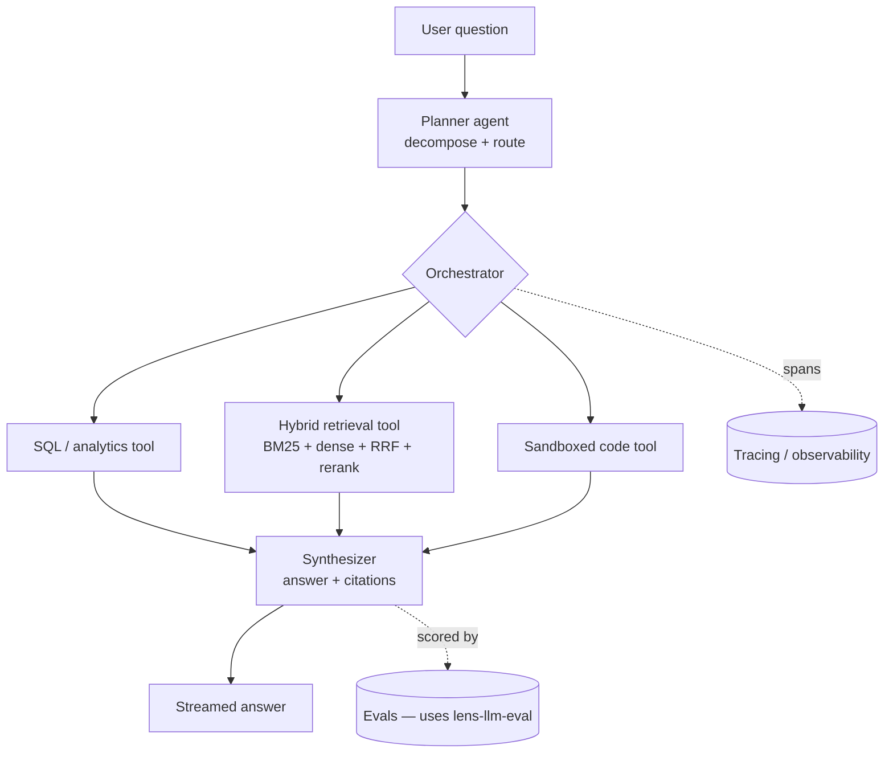

# Atlas — Agentic Analytics Assistant

[](https://github.com/VenkateswarluNagineni/atlas-agent/actions/workflows/ci.yml)
[](https://www.python.org/downloads/)
[](LICENSE)

A production **multi-agent system** that answers analytical questions over data. A planner
decomposes the question; tool-using sub-agents run **SQL/analytics**, **hybrid retrieval**
(BM25 + dense vectors with reciprocal-rank fusion), and **sandboxed code execution**; a
synthesizer composes a cited answer. Built with the production concerns that demos skip:
**observability/tracing, evaluation, caching, and streaming**.

> Why it exists: most "agent" repos are a single prompt in a `while` loop. Atlas is an
> agent *system* — planning, typed tools, hybrid retrieval, tracing, and evals you can
> actually trust.

## Architecture



## What makes it different

- **Planner → tools → synthesis**, not a single mega-prompt.
- **Hybrid retrieval** — lexical (BM25) + dense vectors fused with **reciprocal rank
  fusion**, then reranked. Beats either retriever alone.
- **Typed tool registry** — tools declare typed schemas; the orchestrator validates calls.
- **Observability first** — every step emits a span; runs are replayable.
- **Evaluated** — answer quality gated by [`lens-llm-eval`](https://github.com/VenkateswarluNagineni/lens-llm-eval), the companion eval framework.

## Tech stack

`Python 3.11` · multi-agent orchestration (LangGraph-style) · `BM25` + dense embeddings +
`FAISS` · reranking · `Anthropic` (Claude) + open models · `FastAPI` (streaming) ·
tracing/observability · `Docker`

## Status

🚧 Built in public, in phases — see **[ROADMAP.md](ROADMAP.md)**. Each phase ships tested
code + a design note in [`docs/`](docs/).

## Quickstart

```bash
pip install -e ".[dev]"
pytest
```

## License

MIT © Venkateswarlu Nagineni
